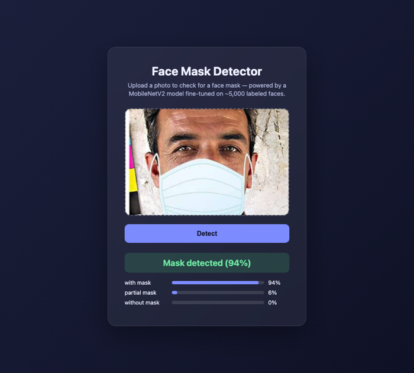
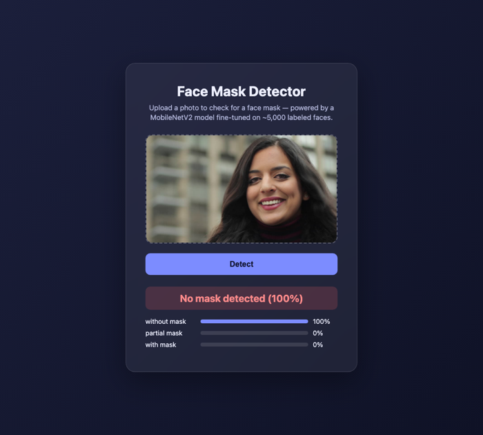
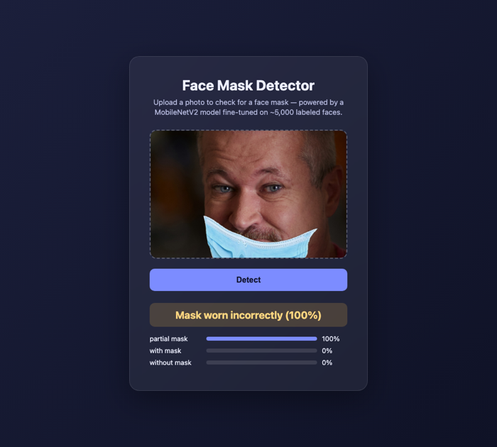

# Face Mask Detector

A face mask classifier with a real web frontend: upload a photo, and it tells you whether the person is wearing a mask correctly, incorrectly, or not at all — with confidence scores for all three.

| With mask | No mask | Worn incorrectly |
|---|---|---|
|  |  |  |

**Stack:** MobileNetV2 (transfer learning) · Flask · vanilla JS frontend

## Background

`Face_Mask_Detection.ipynb` is the original exploration notebook: it tries a custom CNN, a deeper CNN, VGG16, and ResNet50, trained on a [3-class dataset](https://cdn.iisc.talentsprint.com/CDS/MiniProjects/MP2_FaceMask_Dataset.zip) (with_mask / without_mask / partial_mask). It never exported a model — it was Colab-only, with no saved weights and no way to actually use the result.

`backend/train.py` is the model that's actually deployed: MobileNetV2 with a frozen ImageNet base and a small trained head, at 160×160. On this dataset it reaches **97.6% validation accuracy** in 10 epochs (a few minutes on a CPU) — transfer learning was the right call here, matching what the notebook's own experiments concluded.

## Project structure

```
backend/
  train.py            trains the model, saves model/mask_detector.keras
  app.py               Flask API (/predict) + serves the frontend
  model/                trained weights + class_names.json (checked in, ~11MB)
  test_app.py           pytest suite for the API
frontend/
  index.html, styles.css, script.js   upload UI, no build step
```

## Setup

```bash
cd backend
python3 -m venv .venv
source .venv/bin/activate
pip install -r requirements.txt

python app.py   # serves both the API and the frontend on :5001
```

Open `http://localhost:5001`.

The trained model is already checked in, so this works out of the box. To retrain it yourself:

```bash
# download and extract into backend/data/MP2_FaceMask_Dataset/
curl -o dataset.zip https://cdn.iisc.talentsprint.com/CDS/MiniProjects/MP2_FaceMask_Dataset.zip
unzip dataset.zip -d backend/data/

cd backend
python train.py
```

## Running tests

```bash
cd backend
pip install -r requirements.txt
pytest
```

## Notes

- `/predict` returns a friendly 503 (not a crash) if the model file is missing.
- This is a demo, not a medical or safety device — treat predictions as indicative, not authoritative.
